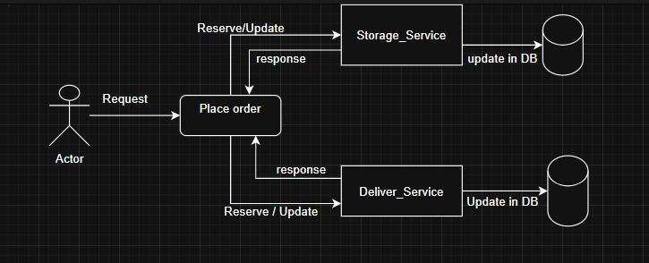
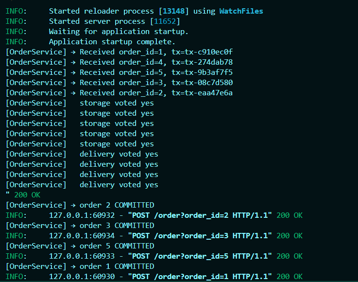
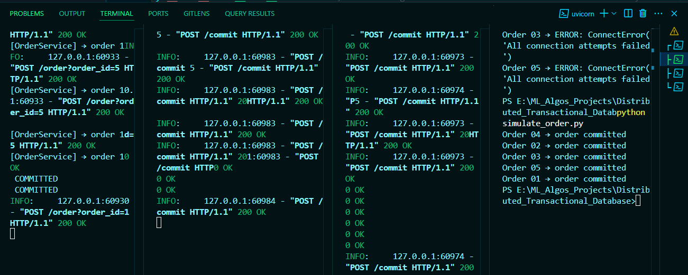

# Distributed Transactional Database with 2-Phase Commit (2PC)

This project simulates a distributed transactional system using the **2-Phase Commit protocol** across microservices:
- `order_service` (Coordinator)
- `delivery_service`
- `storage_service`


Simple Architecture


Microservices


Simulating terminals and handling Concurrent Requests


In distributed systems, coordinating transactions across multiple resources can be complex. In Order to Handle the Concurrency, the Two-Phase Commit Protocol (2PC) is a widely used approach to ensure atomic transactions in distributed systems.

2PC operates in two phases: the Prepare Phase and the Commit Phase.

Prepare/Reserve Phase:
The coordinator sends a Prepare/reserve request to all availabl nodes .
Each Nodechecks if it can complete the transaction and responds with either a Yes (reserved) or No (not_available).
If any participant responds with a No, the process halts, and the transaction is rolled back.
2. Commit Phase:

If all participants respond with Yes, the coordinator sends a Commit command, and all participants commit the transaction.
If any participant responds with No, the coordinator sends an Abort command to rollback the transaction across all participants.


## 🚀 Technologies Used
- FastAPI
- PostgreSQL
- SQLAlchemy
- Async HTTP (httpx)
- Python 3.10+


## 🧠 How It Works
- Each service runs independently on different ports.
- The coordinator sends `/prepare` requests to both services.
- If both vote "yes", it sends `/commit`; else `/rollback`.

## 🛠 Setup Instructions

### 1. Clone the repository
```bash
git clone https://github.com/<your-username>/<your-repo>.git
cd Distributed_Transactional_Database


2. Create and activate virtual environment
bash
Copy
Edit
python -m venv venv
venv\Scripts\activate  # On Windows
3. Install dependencies
bash
Copy
Edit
pip install -r requirements.txt
4. Create .env from .env.example
bash
Copy
Edit
copy .env.example .env  # Use correct DB URLs and passwords
5. Run all three services
bash
Copy
Edit
# In separate terminals:
uvicorn delivery_services.main:app --port 8001 --reload
uvicorn storage_services.main:app --port 8002 --reload
uvicorn order_service.main:app --port 8000 --reload
6. Simulate Orders
bash
Copy
Edit
python simulate_orders.py
